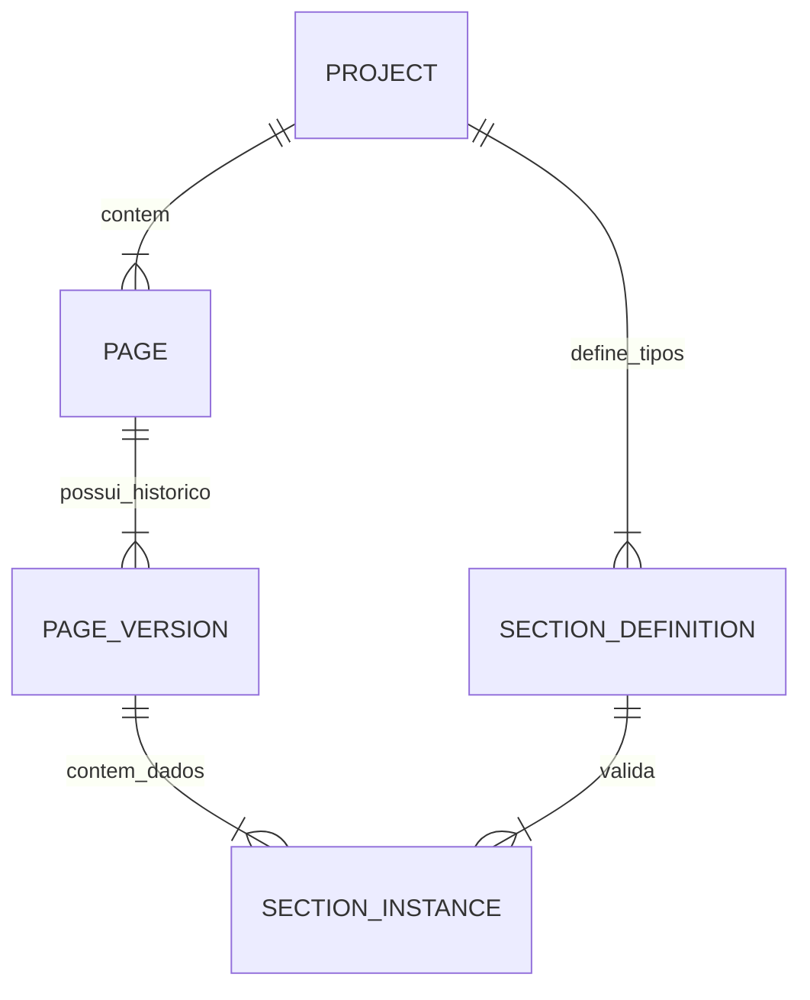

# 📱 AppManager Pro - Devlog & Documentação Técnica

**Status:** Em Desenvolvimento (Beta v1.2)  
**Objetivo:** Plataforma Headless CMS focada em aplicativos móveis (Server-Driven UI), permitindo gestão de conteúdo versionado, criação de esquemas de UI via AI e controle de acesso baseado em cargos.

---

## 🏗️ Arquitetura do Sistema

O sistema foi desenhado para desacoplar a **estrutura de dados** (definida por Desenvolvedores) do **conteúdo** (gerenciado por Marketing/Managers).

### Conceito Core: Server-Driven UI & JSON Schema
Ao invés de "hardcodar" telas no aplicativo móvel, o AppManager envia uma lista JSON de seções.
1.  **Section Definition (Blueprint):** O desenvolvedor (ou a IA) define *quais* campos um componente tem (ex: Hero Banner tem `titulo`, `imagem`, `cta`). Isso é salvo como **JSON Schema**.
2.  **Section Instance (Conteúdo):** O gestor preenche um formulário gerado automaticamente a partir desse Schema.
3.  **App Consumo:** O app móvel recebe o JSON, lê o ID da seção e renderiza o componente nativo correspondente com os dados.

---

## 🚀 Funcionalidades Implementadas

### 1. Sistema de CMS & Versionamento (Core)
O diferencial do AppManager é o tratamento de páginas como software, com ciclo de vida.
*   **Versionamento "One-to-Many":**
    *   Uma **Page** possui múltiplas **Versions**.
    *   Estados: `DRAFT` (Rascunho), `PUBLISHED` (Produção), `ARCHIVED` (Histórico).
*   **Fluxo de Trabalho:**
    *   Criação de Rascunho a partir da versão de produção (Deep Copy).
    *   Edição segura sem afetar o app ao vivo.
    *   Botão "Promote/Publish": Arquiva a versão anterior e ativa a nova instantaneamente.
*   **Editor Visual:** Formulários dinâmicos (`DynamicForm.tsx`) que se adaptam a qualquer JSON Schema.

### 2. Section Builder com IA (Gemini)
Ferramenta para criação rápida de novos componentes de UI.
*   **Prompt-to-Schema:** Integração com **Google Gemini** (`gemini-3-flash-preview`). O usuário descreve: *"Quero um carrossel de produtos com preço e desconto"*.
*   **Geração:** A IA retorna um JSON Schema válido (Draft-07).
*   **Editor de Código:** Visualização e edição manual do JSON gerado antes de salvar.

### 3. Gestão de Projetos & Onboarding
*   **Wizard de Criação:** Fluxo passo-a-passo para criar novos apps (Web view, Shopify, Custom).
*   **Multi-tenancy:** Suporte a múltiplos projetos dentro da mesma organização.
*   **Preview de App:** Simulação visual de como o app ficará (cores, ícones, navegação).

### 4. Gestão de Equipe (RBAC)
Controle de acesso granular definido em `UserRole`:
*   **ADMIN:** Acesso total (Financeiro, Configurações, Deletar).
*   **MANAGER:** Gestão de conteúdo, publicação e equipe.
*   **DEV:** Acesso ao Section Builder (Schemas) e configurações técnicas.
*   **COLLABORATOR:** Apenas edição de conteúdo (sem poder de publicação).

---

## 💾 Modelagem de Dados (Supabase/SQL)

A estrutura relacional foi desenhada para garantir integridade no versionamento.

1.  **`pages`**: Identidade da tela (Slug, Título).
2.  **`page_versions`**: Snapshot no tempo (`status`, `version_name`).
3.  **`section_definitions`**: Schemas (JSON) de como os componentes funcionam.
4.  **`section_instances`**: O conteúdo real (JSONB) vinculado a uma versão específica e a uma definição.

---

## 🛠️ Tech Stack

*   **Frontend:** React 19, TypeScript, TailwindCSS.
*   **Backend/DB:** Supabase (PostgreSQL + Auth).
*   **AI Layer:** Google GenAI SDK (Gemini).
*   **Icons:** Lucide React.
*   **Charts:** Recharts.

---

## 🗺️ Roadmap & Funcionalidades Futuras

### Q1 - Consolidação (Atual)
- [x] Estrutura de Versionamento (Draft/Publish).
- [x] Integração com Gemini para Schemas.
- [x] UI de Dashboard e Listagens.
- [ ] Conectar UI aos Actions do Supabase (WIP).
- [ ] Implementar autenticação real (Login/Logout).

### Q2 - Expansão de Features ("Coming Soon")
- [ ] **Analytics Pro:** Gráficos reais de DAU/MAU conectados ao Supabase.
- [ ] **Chat Real-time:** Suporte ao cliente integrado no app.
- [ ] **Monetização:** Gestão de IAP (In-App Purchases) e Assinaturas.
- [ ] **Posts/Blog:** Módulo separado para conteúdo textual longo (artigos).

### Q3 - Infraestrutura
- [ ] **Webhooks:** Notificar o App quando uma versão for publicada (para limpar cache).
- [ ] **CDN:** Servir os JSONs de conteúdo via Edge Functions para baixa latência.
- [ ] **SDK Mobile:** Criar biblioteca React Native para consumir esse CMS facilmente.

---

## 📝 Notas de Desenvolvimento

*   *Convenção de Código:* Utilizamos `snake_case` para objetos que vêm do banco de dados e `camelCase` para propriedades internas do React.
*   *Segurança:* As Policies (RLS) do Supabase devem garantir que apenas usuários vinculados ao `company_id` do projeto possam ler/editar.
